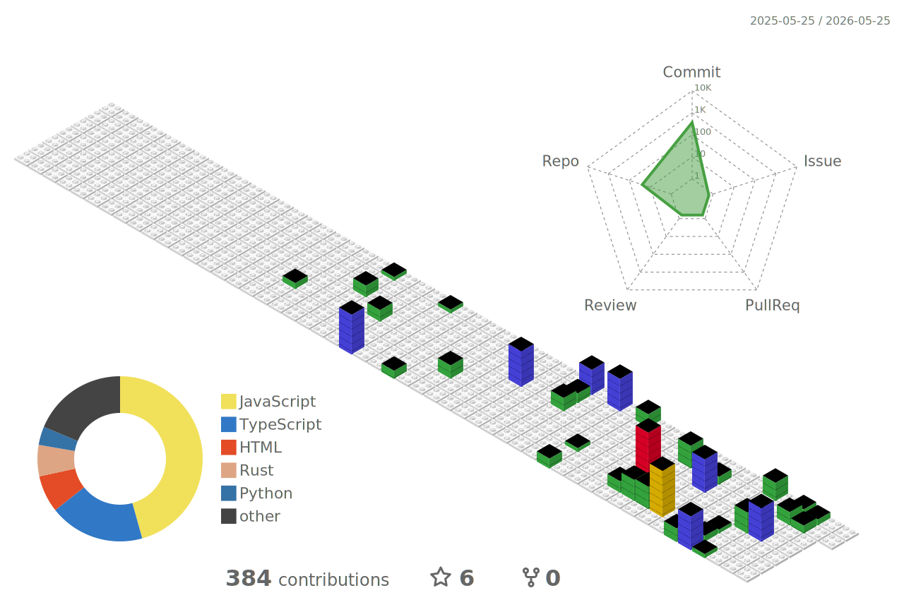
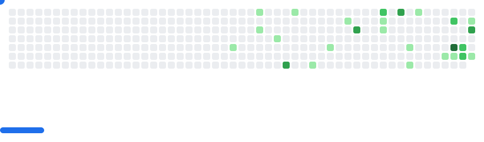

# About Me

I'm a passionate Software Developer from India 🇮🇳, currently pursuing BTech in Computer Science Engineering.  
I love building things with Python, C++, JavaScript, and exploring React Native, Web Development, and Cloud platforms.  
Constantly learning, experimenting, and turning ideas into code.

	
 

## 🔗 Connect with Me

  
  
  

## Technical Skills

	
  
  
  
  
  
  

## Tools

  
  
  
  
  
  
  
  
  
  
  
 

## GitHub Dashboard

	

 

>**These statistics are presented in UTC time, which may not correspond to my local time. Contributions may be a few hours out of date.*

>**The language charts are based on recent commits.*

**Profile Views Counter**

### :octocat: [sohansarkar07](https://github.com/sohansarkar07/sohansarkar07)

###

<picture>
  <source media="(prefers-color-scheme: dark)" srcset="https://github.com/sohansarkar07/sohansarkar07/raw/output-pacman/pacman-contribution-graph-dark.svg">
  <source media="(prefers-color-scheme: light)" srcset="https://github.com/sohansarkar07/sohansarkar07/raw/output-pacman/pacman-contribution-graph.svg">
  
</picture>

###

<picture>
  <source
    media="(prefers-color-scheme: dark)"
    srcset="images/breakout-dark.svg"
  />
  <source
    media="(prefers-color-scheme: light)"
    srcset="images/breakout-light.svg"
  />
  
</picture>

###

## GitHub Summary Metrics Card

Click to Expand

  

    
  

